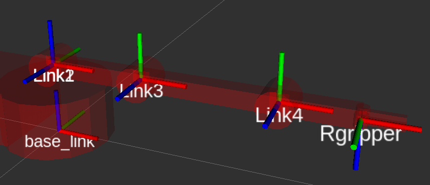

Description
============

This project intend to use the power of ROS and Arduino to bring life to the low cost 4dof OWI Robotic Arm Edge: 

https://www.amazon.com/OWI-Robotic-Soldering-Required-Extensive/dp/B0017OFRCY

This repo is the Arduino side of the project. The ROS side can be checked out at:

https://github.com/ngpbach/owi-ros

See it in action:
https://youtu.be/lFCY_yz-M0M

Status
============

The code is mostly functional and stable. More testing routine might be added to aid with the integration of newly built robot. Once all Joint configs (input output pins, offset, limit, pid...) are set right, passing control to ROS is pretty solid. Not yet implemented are concurency protection for data in RTOS... but at worst, a few instances of corrupted data now and then are just noise and has no big consequence for this cheap project.

Build
============

The easiest way to compile this project is using VSCode with PlatformIO add-on, or PlatformIO IDE. PlatformIO will detect the platform and dependencies (Arduino, FreeRTOS) and will pull the appropriate libraries for them. If using Windows you'll need Arduino driver. If using Linux, follow the instruction to give approprate permissions:

https://docs.platformio.org/en/latest/faq.html#platformio-udev-rules

Docs
============

Doxygen documentation can be access here:

https://ngpbach.github.io/owi-arduino

A brief description of how it will run (details will come soon):

After uploading the compiled firmware, Arduino can be communicate with Serial Monitor using builtin USB port (9600 baud). ROS communication is done through Serial1 port (need a UART-USB adapter such as CP210x, 115200 baud). At startup Arduino only report the joint angles to ROS and does not listen to command. Use Serial Monitor to display the menu, do the tests to make sure that the direction of all joints are as intended, then use the choice to hand over control to ROS. From then on PID control thread will repeatedly run to track the commanded joint positions from ROS.

Quick Notes
============

For new robot built, use the joint configs in include/jointconfig.hh to tune each joint 1 by 1. All angle are in degree (int)

- On ROS side, run roslaunch owi simulate.launch and use the slider to see what the positive direction of each joint is. Connect to serial monitor to and the "test direction" menu first to see if joint and pot move in the same and correct direction. This would bypass all limit checks so make sure the tested joint has about +-30deg room to move. If moving direction is wrong then either swap the physical pins or swap dirPin in the config. If test fail it mean the pot is oposite direction of movement, swap GND and 5V on the pot.

- If you are using only 1 pin for motor direction, just plug in one dirPin ignore the other dirPin.

- (Correct offset value) = (Reported angle) - (Real angle) + (Curent offset value)

- I used 6.5V for the motor driver. Since all motors can run at once, current used can be >2A. The pots should have their own 5V regulator.

- PID output percentage of max PWM. For ex. kp=0.1, setpoint-currentpoint = 10deg => effort = 0.1*10 = 100%. Best to keep kp < 0.1 to avoid saturation.

The robot description was buit matching the following D_H table (degrees and meters units):

|   | alpha  | theta  | r     | d     |
|---|--------|--------|-------|-------|
| r | 0      | var    | 0     | 0.065 |
| r | 90     | var    | 0.085 | 0     |
| r | 0      | var    | 0.115 | 0     |
| r | 0      | var    | 0.06  | 0     |

A illustration of the frames with all theta=0

